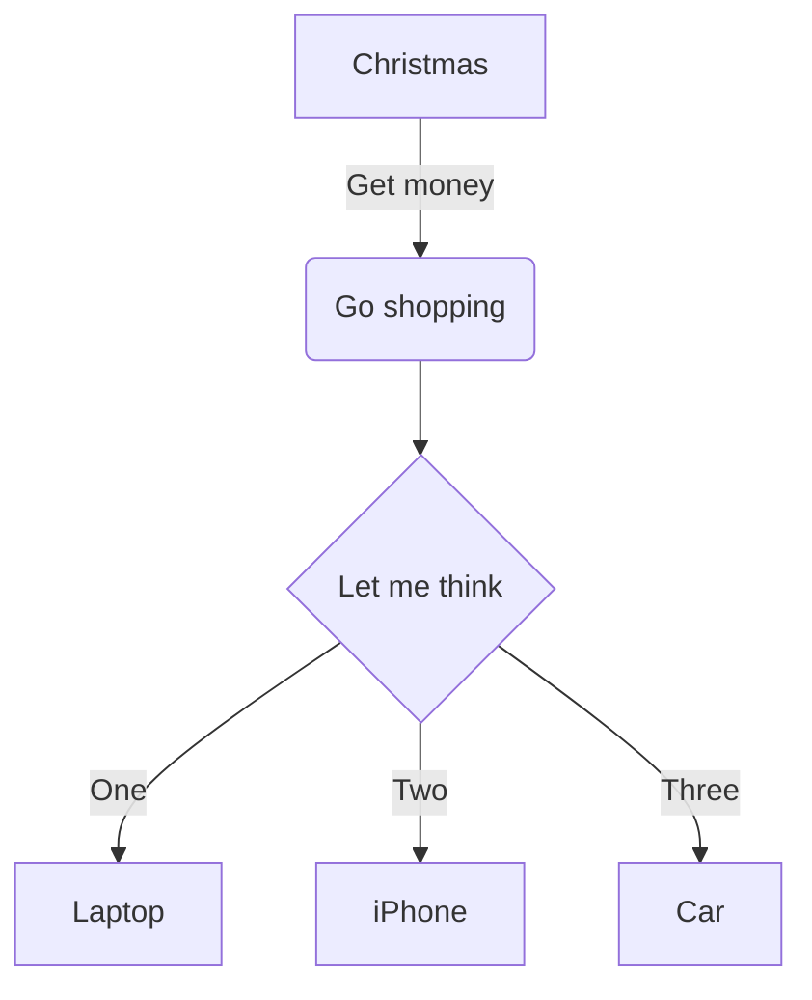

<div class="mermaid">
graph TD;
    A-->B;
    A-->C;
    B-->D;
    C-->D;
</div>




```flow
st=>start: Start
op=>operation: Your Operation
cond=>condition: Yes or No?
e=>end

st->op->cond
cond(yes)->e
cond(no)->op
```


$$
\begin{align}
\sqrt{37} & = \sqrt{\frac{73^2-1}{12^2}} \\
 & = \sqrt{\frac{73^2}{12^2}\cdot\frac{73^2-1}{73^2}} \\ 
 & = \sqrt{\frac{73^2}{12^2}}\sqrt{\frac{73^2-1}{73^2}} \\
 & = \frac{73}{12}\sqrt{1 - \frac{1}{73^2}} \\ 
 & \approx \frac{73}{12}\left(1 - \frac{1}{2\cdot73^2}\right)
\end{align}
$$

$$
\begin{aligned}
\dot{x} &= \sigma(y-x) \\
\dot{y} &= \rho x - y -xz \\
\dot{z} &= -\beta z + xy
\end{aligned}
$$
